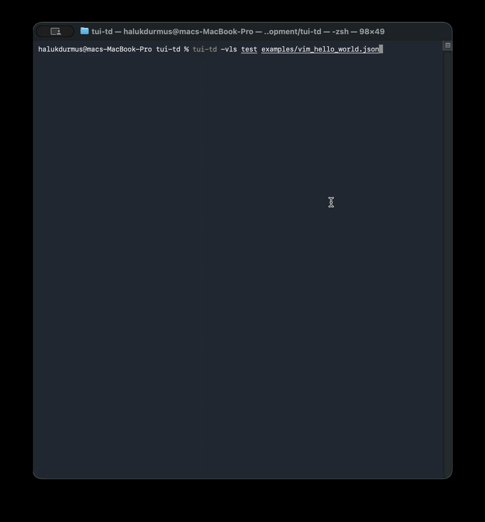

# TUI Test Drive

[](https://rubygems.org/gems/tui-td)
[](LICENSE.txt)

Testing framework for Terminal User Interfaces (TUIs). Start a TUI in a PTY, send input, analyze output — as structured JSON, plain text, PNG screenshots, or HTML renders.

**Language-agnostic:** The JSON test runner and CLI let you test TUIs from any language (Python, JavaScript, Rust, Go, …). Just write a `.json` file or pipe commands through `tui-td serve` (MCP).

**Ruby-native:** If you're in the Ruby ecosystem, tui-td integrates natively with RSpec and Minitest — auto-wait matchers and assertions included.

> New to tui-td? Jump to [Quick Start](docs/quick_start.md).

**What tui-td gives you:**

1. **Start any TUI** in a virtual terminal (PTY) with `Driver` or JSON test plans
2. **Auto-wait assertions** — matchers automatically retry until the condition is met or timeout
3. **Semantic selectors** — `get_by_role(:button)`, `get_by_role(:dialog)`, `within { }` scoping
4. **Multiple output formats** — structured JSON, plain text, PNG screenshots, HTML renders
5. **JSON test runner** — language-agnostic, 23+ step types, CI-friendly
6. **RSpec matchers** — `have_text`, `have_fg`, `have_button`, `have_dialog`, and more
7. **Minitest assertions** — `assert_text`, `assert_button`, `assert_snapshot`, and more
8. **MCP server** — AI agents can drive TUIs via JSON-RPC over stdio
9. **Pure Ruby rendering** — embedded Spleen font + 2766 Unifont glyphs, no native deps required

## Installation

Ruby 3.0+ is required. Install via [rbenv](https://github.com/rbenv/rbenv#installation) or `brew install ruby`.

```bash
gem install tui-td
```

Quick test:

```bash
tui-td capture "echo Hello World"
```

## CLI Usage

```bash
# Capture output of any terminal command
tui-td capture "ls -la"

# Capture with custom terminal size
tui-td -r 24 -c 80 capture "vim --version"

# Run a command from a specific directory
tui-td -C /path/to/project capture "make test"

# Output as JSON for scripts
tui-td --json capture "ls -la"

# Save as HTML for browser visualization
tui-td --html output.html capture "htop"

# Save as a PNG screenshot
tui-td --screenshot output.png capture "htop"

# Drive a TUI interactively
tui-td drive "htop"
# At the > prompt:
#   state       Show current terminal state as pretty JSON
#   raw         Show raw ANSI output (first 2000 chars)
#   key <name>  Send a special key (enter, up, down, tab, escape, ctrl_c, ...)
#   exit        Quit
#   <anything>  Sent as text + Enter to the TUI

# Start MCP server for AI integration
tui-td serve
```

## CLI Reference

```
Usage: tui-td <command> [options]

Commands:
  serve              Start MCP server (JSON-RPC over stdio)
  capture <command>  Run once, capture and display state
  drive <command>    Drive a TUI interactively
  run <command>      Run a TUI app and show live output
  test <file.json>   Run JSON test file
  help [topic]       Show this help, or help test / help rspec

Examples:
  tui-td capture "ls -la"
  tui-td --screenshot out.png capture "htop" --timeout 5
  tui-td --html out.html capture "glow README.md"
  tui-td -C /my/project capture "make test"
  tui-td drive "vim file.txt" --rows 24 --cols 80
  tui-td test examples/echo_test.json
  tui-td -vl test examples/vim_hello_world.json
  tui-td serve

Interactive commands (drive mode):
  state              Show terminal state as pretty JSON
  raw                Show raw ANSI output
  elements           Show detected UI elements (buttons, dialogs, etc.)
  key <name>         Send keystroke (enter, tab, escape, up, down, left, right,
                     backspace, ctrl_c, ctrl_d)
  <text>             Send text to the TUI
  exitstatus         Show process exit status (nil if running)
  exit               Quit drive mode

Global options:
    -r, --rows N                     Terminal rows (default: 40)
    -c, --cols N                     Terminal cols (default: 120)
    -t, --timeout SECONDS            Timeout in seconds (default: 30)
    -C, --chdir PATH                 Working directory for the command
        --screenshot PATH            Save screenshot (e.g., output.png)
        --html PATH                  Save HTML render (e.g., output.html)
        --json                       Output state as compact JSON
        --pretty                     Output state as pretty JSON
        --text                       Output state as plain text table
    -v, --verbose                    Show each test step as it runs
    -l, --live                       Show terminal state after each step (screen-refresh)
    -s, --step                       Pause after each test step for confirmation
        --version                    Show version
    -h, --help                       Show help
```

`tui-td --help` serves as the full CLI reference. `tui-td help test` shows all JSON test
step types, `tui-td help rspec` shows all RSpec matchers, and `tui-td help minitest` shows all Minitest assertions — no need to consult the docs.

## Demo

Step-by-step live view of a vim test — type "Hello World", copy the line, replace "World" with "Sun":



```bash
tui-td -vls test examples/vim_hello_world.json
```

## Ruby API

### Driver — Start, send, capture

```ruby
require "tui_td"

driver = TUITD::Driver.new("htop", rows: 40, cols: 120, timeout: 30)
driver.start

# Send input
driver.send("hello world\n")
driver.send_keys(:enter)     # :enter, :tab, :escape
driver.send_keys(:up)        # :up, :down, :left, :right
driver.send_keys(:ctrl_c)    # :ctrl_c, :ctrl_d, :backspace

# Wait for expected output
driver.wait_for_text("> ")
driver.wait_for_stable          # Wait until 300ms of silence
driver.wait_for_exit            # Wait until process ends

# Read output
driver.raw_output               # Raw ANSI string
driver.state_data               # Structured Hash with :raw, :rows, :cursor, :size
driver.state_json                # JSON string (includes raw ANSI)
driver.state_json(pretty: true)  # Pretty JSON

# Visual capture
driver.screenshot("screenshot.png")  # PNG renderer
TUITD::HtmlRenderer.new(driver.state_data).render("output.html")  # HTML renderer
html_string = TUITD::HtmlRenderer.new(driver.state_data).to_html   # HTML string

driver.close
```

### State — Analyze terminal content

```ruby
state = TUITD::State.new(driver.state_data)

# Read text
state.plain_text                # "Hello\n> prompt\n"
state.text_at(row, col, length) # Extract substring at position
state.find_text("error")        # [{row: 2, col: 10, text: "error", full_line: "..."}]

# Inspect cells
state.foreground_at(0, 5)       # "cyan"
state.background_at(0, 5)       # "bright_black"
state.style_at(0, 5)            # {bold: true, italic: false, underline: false}

# AI-optimized compact output
state.to_ai_json
# => {
#   size:    {rows: 40, cols: 120},
#   cursor:  {row: 5, col: 12},
#   text:    "> Hello\n...",
#   highlights: [
#     {row: 0, text: "MyApp v1.0.0", bold: true, fg: "cyan"}
#   ],
#   summary: "Cursor at [5,12]. 1 styled row, colors: fg=cyan."
# }
```

### Full example — Test a TUI programmatically

```ruby
require "tui_td"

driver = TUITD::Driver.new("my_tui_app", rows: 24, cols: 80)
driver.start

# Wait for the initial prompt
driver.wait_for_text("> ", timeout: 10)

# Send a command
driver.send("list files\n")
driver.wait_for_stable

# Analyze output
state = TUITD::State.new(driver.state_data)

if state.find_text("ERROR").any?
  puts "Bug found!"
  driver.screenshot("error_proof.png")
end

# Check colors
welcome_fg = state.foreground_at(0, 0)
raise "Expected cyan header" unless welcome_fg == "cyan"

# Send more commands, inspect, loop...
driver.send("/quit\n")
driver.wait_for_exit
driver.close
```

## Testing

tui-td supports two test formats: **JSON** for declarative, framework-agnostic tests, and **RSpec** for Ruby-native tests with custom matchers.

### JSON Test Format

Tests are defined as JSON with a sequence of action steps. Each step maps to a tui-td operation.

Run with the `tui-td test` command:

```bash
tui-td test examples/echo_test.json
```

**Format:**

```json
{
  "name": "My test",
  "rows": 24,
  "cols": 80,
  "timeout": 10,
  "chdir": "/path/to/project",
  "before_all": [
    { "start": "my_tui_app", "env": { "DATABASE_URL": "test://" } }
  ],
  "steps": [
    { "wait_for_text": "> " },
    { "send": "hello\n" },
    { "assert_text": "hello" },
    { "assert_regex": "hello|world" },
    { "assert_fg": [0, 0], "is": "cyan" }
  ],
  "after_all": [
    { "close": true }
  ]
}
```

**Available steps:**

| Step | Key | Description |
|------|-----|-------------|
| `start` | `"command"` | Start a TUI application |
| `send` | `"text"` | Send text (use `\n` for Enter) |
| `send_key` | `"key"` | Send a special key (`enter`, `up`, `ctrl_c`, ...) |
| `wait_for_text` | `"text"` | Wait until text appears |
| `wait_for_stable` | — | Wait until output is stable |
| `assert_text` | `"text"` | Assert that text exists on screen |
| `assert_not_text` | `"text"` | Assert that text does NOT exist on screen |
| `assert_regex` | `"pattern"` | Assert that regex pattern matches (e.g. `"error\|fail"`) |
| `assert_fg` | `[row, col], "is": "color"` | Assert foreground color |
| `assert_bg` | `[row, col], "is": "color"` | Assert background color |
| `assert_style` | `[row, col], "bold": true` | Assert cell style (bold, italic, underline) |
| `wait_for_exit` | — | Wait until the process exits |
| `assert_exit` | `N` | Assert the process exit code equals N |
| `screenshot` | `"path"` | Save PNG screenshot |
| `html` | `"path"` | Save HTML render for browser viewing |
| `assert_button` | `"text"` | Assert a button with given text is visible (`[ OK ]`, `(Cancel)`, `<Submit>`) |
| `assert_dialog` | — | Assert a dialog (box-drawing region) is visible |
| `assert_checkbox` | `"label", "checked": true` | Assert a checkbox with given label (and optionally checked state) |
| `assert_role` | `":button", "text": "OK"` | Generic role assertion (`:button`, `:checkbox`, `:dialog`, `:statusbar`, `:progress`, `:input`, `:label`, `:menu`, `:tab`) |
| `assert_input` | `"text"` (optional) | Assert an input field (`[____]`) is visible |
| `assert_label` | `"text"` | Assert a label (text ending with colon) is visible |
| `assert_menu` | `"text"` (optional) | Assert a menu bar or dropdown item is visible |
| `assert_tab` | `"text"` | Assert a tab (`[Tab1]`) is visible |
| `assert_statusbar` | — | Assert a status bar (bottom row with background) is visible |
| `assert_progress_bar` | `"text"` (optional) | Assert a progress bar (`[####]`) is visible |
| `close` | — | Close the TUI |

Example with `html` step for before/after snapshots:

```json
{
  "name": "Visual diff test",
  "rows": 40, "cols": 120,
  "steps": [
    { "start": "my_tui_app" },
    { "wait_for_stable": true },
    { "html": "/tmp/before.html" },
    { "send": "Help\n" },
    { "wait_for_stable": true },
    { "html": "/tmp/after.html" },
    { "close": true }
  ]
}
```

**Ruby API:**

```ruby
plan = File.read("test/example.json")
result = TUITD::TestRunner.new(plan).run
puts result[:passed]  # => true
result[:results].each { |r| puts "#{r[:step]}: #{r[:passed]} - #{r[:message]}" }
```

### RSpec Tests

Use custom matchers for expressive, Ruby-native TUI tests:

```ruby
require "tui_td"
require "tui_td/matchers"

RSpec.describe "My TUI" do
  before(:all) do
    @driver = TUITD::Driver.new("my_tui_app", rows: 24, cols: 80)
    @driver.start
  end

  after(:all) { @driver&.close }

  let(:state) { TUITD::State.new(@driver.state_data) }

  it "shows welcome message" do
    expect(state).to have_text("Welcome")
  end

  it "has a cyan header" do
    expect(state).to have_fg("cyan").at(0, 0)
  end

  it "has a blue background on row 3" do
    expect(state).to have_bg("blue").at(3, 0)
  end

  it "has bold text on the first line" do
    expect(state).to have_style.at(0, 0).with(bold: true)
  end
end
```

**Matchers:**

| Matcher | Usage |
|---------|-------|
| `have_text("...")` | Assert text is present on screen |
| `have_regex(/pattern/)` | Assert regex pattern matches anywhere |
| `have_fg("color").at(row, col)` | Assert foreground color at position |
| `have_bg("color").at(row, col)` | Assert background color at position |
| `have_style.at(row, col).with(bold: true, ...)` | Assert cell style |
| `have_button("OK")` | Assert a button with given text is visible |
| `have_dialog` | Assert a dialog (box-drawing region) is visible |
| `have_checkbox("Label").checked` | Assert a checkbox with given label (chain `.checked`) |
| `have_role(:button, text: "OK", checked: true, disabled: false)` | Generic role assertion with optional text, checked, disabled filters |
| `have_input` | Assert an input field (`[____]`) is visible |
| `have_label("Name")` | Assert a label (text ending with colon) is visible |
| `have_menu` | Assert a menu bar or dropdown item is visible |
| `have_tab("File")` | Assert a tab is visible |
| `have_statusbar` | Assert a status bar (bottom row with background) is visible |
| `have_progress_bar("50%")` | Assert a progress bar (`[####]`) is visible |
| `have_exit_status(N)` | Assert the driver process exit status equals N |

## Minitest Assertions

Include the assertions module for native Minitest support (auto-wait included):

```ruby
require "tui_td/minitest/assertions"

class MyTUITest < Minitest::Test
  include TUITD::Minitest::Assertions

  def test_login
    driver = TUITD::Driver.new("my_tui", rows: 24, cols: 80)
    driver.start
    assert_text(driver, "Welcome")
    assert_button(driver, "OK")
    refute_text(driver, "Error")
    assert_snapshot(driver, "login", type: :text, region: 0..6)
  ensure
    driver&.close
  end
end
```

| Assertion | Usage |
|-----------|-------|
| `assert_text(driver, "...")` | Assert text is present |
| `refute_text(driver, "...")` | Assert text is NOT present |
| `assert_regex(driver, /pattern/)` | Assert regex matches |
| `assert_fg(driver, "cyan", row:, col:)` | Assert foreground color |
| `assert_bg(driver, "blue", row:, col:)` | Assert background color |
| `assert_style(driver, row:, col:, bold: true)` | Assert cell style |
| `assert_exit_status(driver, 0)` | Assert process exit status |
| `assert_button(driver, "OK")` | Assert button with given text |
| `assert_dialog(driver)` | Assert a dialog is visible |
| `assert_checkbox(driver, "Label", checked: true)` | Assert checkbox with state |
| `assert_role(driver, :button, text: "OK")` | Generic role assertion |
| `assert_input(driver)` | Assert an input field |
| `assert_label(driver, "Name")` | Assert a label |
| `assert_menu(driver)` | Assert a menu |
| `assert_tab(driver, "File")` | Assert a tab |
| `assert_statusbar(driver)` | Assert a status bar |
| `assert_progress_bar(driver)` | Assert a progress bar |
| `assert_snapshot(driver, "name", type:, region:, ignore_rows:)` | Named snapshot comparison |

See `tui-td help minitest` for the full reference.

## Snapshot Testing

Named, persisted snapshot testing à la Playwright/Jest. First run creates a golden master — subsequent runs compare.

### RSpec

```ruby
# Named snapshot (recommended)
expect(driver).to match_snapshot("login_screen")
expect(driver).to match_snapshot("login_screen", type: :all, wait: true)

# Partial screen comparison
expect(driver).to match_snapshot("banner", region: 0..6, chars_only: true)

# Skip volatile rows (e.g., prompt line)
expect(driver).to match_snapshot("main", ignore_rows: [5])

# In-memory comparison (legacy)
pre = driver.snapshot
expect(driver).to match_snapshot(pre, chars_only: true)
```

### Configuration

```ruby
TUITD.configure do |c|
  c.snapshot_dir = "spec/snapshots"   # default
end

# Update all snapshots
UPDATE_SNAPSHOTS=1 bundle exec rspec
```

### JSON Test Steps

```json
{"snapshot": "login_screen", "type": "text"}
{"assert_snapshot": "login_screen", "type": "png", "wait": true}
```

### Types

| Type | Comparison | File |
|------|-----------|------|
| `:text` | chars only (ignores colors/styles) | `.json` |
| `:full` | full cell comparison (chars + colors) | `.json` |
| `:png` | screenshot byte-identical | `.png` |
| `:html` | HTML render byte-identical | `.html` |
| `:all` | all three at once | `.json` + `.png` + `.html` |

## MCP Server — AI Integration

Start the MCP server to let any MCP client control TUIs:

```bash
tui-td serve
```

### Available tools

| Tool | Description |
|------|-------------|
| `tui_start` | Start a TUI application. Call first. |
| `tui_send` | Send text input. Use `\n` for Enter. |
| `tui_send_key` | Send special keys: `enter`, `tab`, `up`, `down`, `left`, `right`, `escape`, `ctrl_c`, `ctrl_d` |
| `tui_wait_for_text` | Wait until specified text appears in output (with timeout). |
| `tui_wait_for_stable` | Wait until terminal output stabilizes (300ms of silence). |
| `tui_state` | Get terminal state: AI-friendly compact mode (default), `full` grid, or `text` only. |
| `tui_plain_text` | Get plain text content, ANSI stripped. |
| `tui_screenshot` | Capture a PNG screenshot of the current terminal. |
| `tui_html_render` | Render terminal state as a self-contained HTML document. Returns HTML inline or saves to file. |
| `tui_wait_for_exit` | Wait until the TUI process exits. Returns exit status. |
| `tui_exit_status` | Get the exit status code (nil if still running). |
| `tui_find_text` | Search for text or regex in terminal state. Supports match modes: `partial` (default), `exact`, `regex`. |
| `tui_find_elements` | Detect UI elements (buttons, checkboxes, dialogs, inputs, labels, menus, tabs, etc.) with optional role, text, checked, and disabled filters. |
| `tui_element_actions` | Get click/type/press_key action hashes for a detected UI element. For AI-driven interaction. |
| `tui_diff` | Compare current state against a previous snapshot. Returns cell-level differences. |
| `tui_annotate_element` | Manually register a UI element annotation. Picked up by tui_find_elements. |
| `tui_save_snapshot` | Save the current terminal state as a named snapshot to disk. |
| `tui_assert_snapshot` | Assert current state matches a saved named snapshot. Creates on first run. |
| `tui_close` | Close the TUI and clean up. |

### MCP configuration

Add to your MCP client configuration:

```json
{
  "mcpServers": {
    "tui-td": {
      "command": "tui-td",
      "args": ["serve"]
    }
  }
}
```

### Example MCP session

```json
// 1. Start the TUI
{"method": "tools/call", "params": {"name": "tui_start", "arguments": {"command": "htop"}}}

// 2. Wait for prompt
{"method": "tools/call", "params": {"name": "tui_wait_for_text", "arguments": {"text": "> "}}}

// 3. Send a command
{"method": "tools/call", "params": {"name": "tui_send", "arguments": {"text": "Write hello.rb\n"}}}

// 4. Wait for output
{"method": "tools/call", "params": {"name": "tui_wait_for_stable", "arguments": {}}}

// 5. Get AI-friendly state
{"method": "tools/call", "params": {"name": "tui_state", "arguments": {"format": "ai"}}}

// 6. Take screenshot if needed
{"method": "tools/call", "params": {"name": "tui_screenshot", "arguments": {"path": "/tmp/proof.png"}}}

// 7. Render as HTML (save to file or get inline)
{"method": "tools/call", "params": {"name": "tui_html_render", "arguments": {"path": "/tmp/proof.html"}}}
// Or without path to get HTML inline:
// {"method": "tools/call", "params": {"name": "tui_html_render", "arguments": {}}}

// 8. Search for text in the terminal
{"method": "tools/call", "params": {"name": "tui_find_text", "arguments": {"pattern": "error|fail"}}}

// 9. Find UI elements by role
{"method": "tools/call", "params": {"name": "tui_find_elements", "arguments": {"role": "button"}}}

// 10. Get actions for an element
{"method": "tools/call", "params": {"name": "tui_element_actions", "arguments": {"role": "button", "text": "OK"}}}

// 11. Check exit status (or wait for exit)
{"method": "tools/call", "params": {"name": "tui_exit_status", "arguments": {}}}

// 12. Clean up
{"method": "tools/call", "params": {"name": "tui_close", "arguments": {}}}
```

## State Format

Top-level structure returned by `state_data` / `--json`:

```json
{
  "size":            {"rows": 40, "cols": 120},
  "cursor":          {"row": 5, "col": 12},
  "cursor_visible":  true,
  "cursor_style":    "block",
  "mouse_mode":      null,
  "mouse_format":    null,
  "rows":            [[{"char": "A", "fg": "cyan", ...}]],
  "raw":             "\e[31mred\e[0m\n..."
}
```

Each cell in the `rows` grid:

```json
{
  "char": "A",
  "fg": "cyan",
  "bg": "default",
  "bold": true,
  "italic": false,
  "underline": false
}
```

`raw` is the original ANSI output with all escape sequences preserved.

### Color value formats

| Format | Example | Description |
|--------|---------|-------------|
| `"default"` | — | Terminal default color |
| Named | `"red"`, `"cyan"` | Standard 16 ANSI colors |
| Bright | `"bright_red"`, `"bright_green"` | Bright 16 ANSI colors |
| 256-color | `"color82"` | XTerm 256-color palette |
| TrueColor | `"#ff6432"` | 24-bit hex RGB |

## Screenshot

Screenshots are rendered using the embedded Spleen 8×16 bitmap font via `chunky_png`. No external tools required (no npm, no ImageMagick). Handles all color formats and styles (bold, italic, underline).

```ruby
# Via CLI
tui-td --screenshot output.png capture "echo 'Hello World'"

# Via Ruby API
driver.screenshot("output.png")
```

## HTML Renderer

Renders terminal state as a self-contained HTML document with inline CSS. Faithfully reproduces colors, bold, italic, underline, and cursor position — so an LLM or human can "see" the TUI in any browser without external dependencies.

Features:
- Dark theme matching terminal appearance
- Run-length encoding of adjacent identically-styled cells (compact HTML)
- Cursor indicator (yellow outline)
- HTML entity escaping (`<`, `>`, `&`, `"`)
- All ANSI color formats: 16 named, bright, 256-color, TrueColor

```bash
# CLI — capture once
tui-td --html output.html capture "htop"

# CLI — run with custom terminal size
tui-td --html /tmp/demo.html run "htop" --rows 40 --cols 120
```

```ruby
# Ruby API — render to file
TUITD::HtmlRenderer.new(driver.state_data).render("output.html")

# Ruby API — get HTML string (e.g. for API responses)
html = TUITD::HtmlRenderer.new(driver.state_data).to_html
```

```json
// Test-Runner — before/after snapshots
{"html": "/tmp/snapshot.html"}
```

## License

MIT
